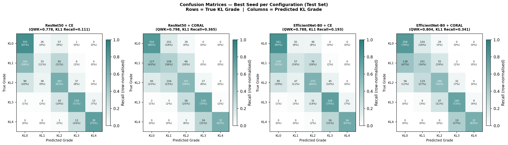

::: {custom-style="Abstract Title"}
Abstract
:::

Knee osteoarthritis (OA) is a leading cause of musculoskeletal disability globally, with radiographic severity graded using the Kellgren-Lawrence (KL) scale. Automated grading using convolutional neural networks (CNNs) has shown promise, yet KL Grade 1 (doubtful OA) remains poorly detected across architectures, with a meta-analytic sensitivity of only 0.64. Because KL grading is ordinal, existing ordinal-regression literature suggests that training objectives preserving grade order may be better aligned with the task than categorical cross-entropy (CE), which treats KL grades as unordered classes. However, it remains clinically important to quantify whether this advantage improves the specific early-OA failure mode of KL1 detection, rather than only overall grading performance. This study therefore compared CE and CORAL ordinal loss across two CNN architectures (ResNet50 and EfficientNet-B0) on the Kaggle Knee Osteoarthritis Dataset (n=8,260 anteroposterior radiographs, KL grades 0–4) across three random seeds, yielding 12 training runs. Primary outcomes were KL1 recall and Quadratic Weighted Kappa (QWK). Grad-CAM explainability analysis was performed on shared misclassification cases, with heatmaps inspected by the author, a qualified MSK radiographer, to identify recurring patterns in model attention and error behaviour. CORAL loss consistently improved KL1 recall across both architectures: ResNet50+CORAL achieved 0.341 ± 0.023 versus 0.127 ± 0.013 for ResNet50+CE, and EfficientNet+CORAL achieved 0.354 ± 0.011 versus 0.190 ± 0.021 for EfficientNet+CE. EfficientNet-B0+CORAL achieved the highest mean QWK of 0.809 ± 0.009, approaching the 0.81 "almost perfect agreement" threshold [@landis1977]. Despite these improvements, all configurations remained below the meta-analytic KL1 benchmark. These findings support CORAL as a more clinically appropriate objective than CE for ordinal KL grading, but also show that loss-function optimisation alone is insufficient for reliable early OA detection. The persistent KL1 performance gap points to a broader limitation of image-only models: borderline radiographic appearances may require acquisition and patient context, including weight-bearing status, age and body habitus, to support clinically meaningful interpretation.

# Introduction

Osteoarthritis is the most prevalent musculoskeletal (MSK) condition globally, with knee OA affecting an estimated 365 million people worldwide and representing a leading cause of pain and functional disability [@yang2023knee]. Radiographic grading of knee OA severity is central to clinical decision-making, guiding referral pathways, monitoring disease progression, and determining eligibility for intervention. The KL scale remains the international standard for radiographic OA grading, classifying severity from KL0 (normal) to KL4 (severe) based on the presence and extent of osteophytes, joint space narrowing, subchondral sclerosis, and bony deformity [@kellgren1957].

Among the five grades, KL1 (doubtful OA) carries disproportionate clinical significance. Missing KL1 may delay risk-factor modification, monitoring, or clinical follow-up in symptomatic or high-risk patients. Without timely identification, the window for risk-modifying and symptom-management strategies, including weight management, physiotherapy and activity modification, may narrow. Early detection of KL1 is therefore not a diagnostic nicety but a clinically consequential decision with direct implications for long-term patient outcomes.

Despite this, KL1 remains the most difficult grade to identify reliably, both for human reporters and automated systems. The radiographic changes at KL1 are subtle: small osteophytes at the joint margins that are not always clearly visible, and equivocal joint space narrowing that falls below the threshold of confident diagnosis. Inter-rater variability at KL1 is well documented, with experienced radiologists frequently disagreeing on the same film [@tiulpin2018; @zhao2025dl]. From a radiographic reporting perspective, borderline KL1 appearances are unlikely to be interpreted from image features alone; acquisition context and patient factors may influence how subtle osteophytes or equivocal joint-space narrowing are judged, yet this context is rarely available to an automated grading system operating on images alone.

The application of deep learning to automated KL grading has grown substantially, with CNNs demonstrating promising performance on large radiographic datasets [@tiulpin2018]. However, a meta-analysis of 19 studies reported a mean KL1 sensitivity of only 0.64, highlighting a persistent failure to detect early disease not resolved by advances in architecture alone [@zhao2025dl]. One modifiable modelling choice is the loss function. Since the KL scale is ordinal, objectives such as CORAL are theoretically better aligned with the grading task than CE. The unresolved question is not simply whether ordinal loss improves aggregate performance, but whether it meaningfully improves KL1 detection (the grade most clinically vulnerable to under-recognition) and whether any improvement is sufficient without acquisition or patient-level context. The null hypothesis ($H_0$) states that loss function choice yields no difference in KL1 recall. The alternative hypothesis ($H_1$) states that CORAL loss increases KL1 recall due to its structural alignment with the ordinal scale.

# Methods

This study used a 2×2 factorial design comparing two CNN architectures, ResNet50 and EfficientNet-B0, with two training objectives, CE and CORAL ordinal loss. Each configuration was trained across three random seeds to assess stability.

## Dataset

The Kaggle Knee Osteoarthritis Dataset with Severity Grading [@chen2018knee] was used as the sole dataset for model training and evaluation. It contains 8,260 anteroposterior knee radiographs labelled with KL grades 0–4 [@kellgren1957], organised into predefined train, validation and test folders (n=5,778, 826 and 1,656 respectively; approximately 70/10/20). These splits were retained because patient-level metadata were unavailable, making re-splitting vulnerable to leakage if images from the same patient appeared in multiple partitions. Images were supplied as preprocessed 224×224 single-knee radiographs; no additional resizing, cropping or re-splitting was performed. No ethics approval was required because the dataset is publicly available and contains no personally identifiable information. Class distribution across splits is shown in Table 1. Representative radiographs for each KL grade are provided in Supplementary Figure S3.



| KL Grade | Description | Train (n=5,778) | Validation (n=826) | Test (n=1,656) |
|---|---|---|---|---|
| KL0 | Normal | 2,286 (39.6%) | 328 (39.7%) | 639 (38.6%) |
| KL1 | Doubtful | 1,046 (18.1%) | 153 (18.5%) | 296 (17.9%) |
| KL2 | Mild | 1,516 (26.2%) | 212 (25.7%) | 447 (27.0%) |
| KL3 | Moderate | 757 (13.1%) | 106 (12.8%) | 223 (13.5%) |
| KL4 | Severe | 173 (3.0%) | 27 (3.3%) | 51 (3.1%) |

: Table 1. Class distribution by KL grade across train, validation and test sets.

## Preprocessing

All images underwent the same preprocessing pipeline. CLAHE was applied (clipLimit=2.0, tileGridSize=8×8) to enhance local radiographic contrast [@abdo2022]. Grayscale images were converted to three-channel RGB for compatibility with ImageNet-pretrained models and normalised using ImageNet statistics (mean=[0.485, 0.456, 0.406]; std=[0.229, 0.224, 0.225]). Training augmentation comprised random horizontal flipping (p=0.5), which is anatomically valid as a flipped left knee is radiographically equivalent to a right knee, and rotation (±10°). Validation and test images received no augmentation.

## Model Architectures

ResNet50 [@he2016], a 50-layer residual network with approximately 23.5 million parameters, and EfficientNet-B0 [@tan2019efficientnet], with approximately 4 million parameters, were selected to compare a commonly used residual CNN baseline with a more parameter-efficient architecture. EfficientNet architectures have shown strong performance on this specific dataset; EfficientNet-B5 reached 82% accuracy after label-noise correction [@momenpour2025], and B0 was chosen as the smallest, most deployable family member to assess whether parameter efficiency compromises grading performance. Both architectures were initialised with ImageNet pretrained weights and fully fine-tuned. The final layer produced either five class outputs for CE or four ordinal rank-boundary outputs for CORAL, giving four configurations: ResNet50+CE, ResNet50+CORAL, EfficientNet-B0+CE and EfficientNet-B0+CORAL. Differential learning rates were used: 1×10⁻⁵ for the pretrained backbone and 1×10⁻⁴ for the classification head [@howard2018].

## Loss Functions

CE treats KL grades as unordered categories and does not explicitly encode that adjacent grades are clinically closer than distant grades. CORAL [@cao2020] reformulates the five-class task as four ordered binary decisions: P(grade>0), P(grade>1), P(grade>2) and P(grade>3). At inference, the predicted grade was the number of rank probabilities exceeding 0.5. Class weighting and label correction were not applied, so that within-architecture comparisons reflected loss function choice rather than additional imbalance-handling strategies.

## Training Configuration

Hyperparameters were fixed a priori, informed by prior KL grading studies [@momenpour2025; @tiulpin2018] and standard fine-tuning practice, and held constant across all configurations so that within-architecture comparisons reflected the effect of loss function, while architecture was evaluated as a separate experimental factor. Models were trained using Adam [@kingma2015], weight decay 1×10⁻⁴, batch size 32 and a maximum of 50 epochs. ReduceLROnPlateau reduced the learning rate by a factor of 0.1 after seven epochs without validation loss improvement, and early stopping with patience 10 saved the lowest-validation-loss checkpoint. Four configurations trained across three seeds (42, 123, 456) produced 12 runs. Training was performed on an NVIDIA A100-SXM4-80GB GPU via CSD3. Code, configuration files, SLURM scripts, environment specification and reproduction instructions are available at: <https://github.com/tmzendah/HCDS_Mod05>.

## Evaluation Metrics

Performance was evaluated exclusively on the held-out test set (n=1,656), not used at any stage during training or model selection. QWK served as the primary field-standard metric, penalising distant grade errors proportionally to their clinical severity and enabling direct comparison with published benchmarks [@tiulpin2018; @zhao2025dl]. KL Grade 1 recall was the primary clinical outcome, measuring detection of doubtful OA, which had a meta-analytic sensitivity of 0.64 across 19 studies [@zhao2025dl]. Additional metrics included accuracy, macro AUC, balanced accuracy and per-grade recall. For CORAL models, ordinal threshold probabilities were converted into class probabilities before computing one-vs-rest macro AUC, using the standard rank-to-class decomposition: P(grade=0) = 1 − P(grade>0), P(grade=k) = P(grade>k−1) − P(grade>k) for k=1–3, and P(grade=4) = P(grade>3). Metrics were reported as mean ± sample SD across three seeds. Paired t-tests compared CE and CORAL within each architecture; because n=3, statistical tests were interpreted as exploratory, with emphasis placed on consistency across seeds, effect size and clinical magnitude.

## Fairness and Explainability

The Kaggle dataset contains no demographic or acquisition metadata, preventing subgroup fairness analysis. This limits conclusions about clinical generalisability and is addressed as a priority for future work [@seyyedkalantari2021; @obermeyer2019]. A balanced validation cohort would require prospective recruitment stratified by age, sex, ethnicity and body habitus, with standardised weight-bearing acquisition protocols to ensure demographic representation across KL grades. Gradient-weighted Class Activation Mapping (Grad-CAM) [@selvaraju2017] was applied to KL1 cases misclassified by all four configurations, targeting layer4[-1] for ResNet50 and features[-1] for EfficientNet-B0. Heatmaps were inspected by the author, a qualified MSK radiographer, to identify recurring patterns in model attention and misclassification behaviour, and a central 50% crop localisation score quantified activation within the expected knee joint region [@saporta2022].

# Results

All results are reported as mean ± sample SD across three random seeds on the held-out test set (n=1,656). Statistical comparisons between CE and CORAL used paired t-tests; Wilcoxon signed-rank tests confirmed the direction of all paired differences (W=6, p=0.25 for both architectures) but could not reach significance at n=3, where the minimum achievable two-sided p-value is 0.25. Statistical tests are interpreted as exploratory given n=3; the primary evidence is the consistency of paired differences across seeds, effect size, and clinical magnitude of change. Seeds are not a random sample from a patient population; these tests speak to consistency across initialisations, not generalisation to new data.

## Overall Performance

EfficientNet-B0 with CORAL loss achieved the highest mean QWK (0.809 ± 0.009), the closest configuration to the 0.81 "almost perfect agreement" threshold [@landis1977]. CORAL loss consistently improved QWK within both architectures: by +0.0183 for ResNet50 (paired t=5.497, p=0.016) and +0.0212 for EfficientNet-B0 (paired t=4.244, p=0.026). Overall accuracy remained comparable across loss functions within each architecture (Table 2), indicating that the QWK improvement reflects a reduction in distant-grade errors rather than a wholesale accuracy gain. Macro AUC was comparable across all four configurations (range 0.875–0.882), consistent with broadly equivalent discriminative capacity regardless of loss function or architecture.

| Architecture | Loss | QWK | Accuracy | KL1 Recall | Balanced Acc | Macro AUC |
|---|---|---|---|---|---|---|
| ResNet50 | CE | 0.782 ± 0.004 | 0.642 ± 0.005 | 0.127 ± 0.013 | 0.611 ± 0.010 | 0.876 ± 0.002 |
| ResNet50 | CORAL | 0.800 ± 0.005 | 0.631 ± 0.010 | 0.341 ± 0.023 | 0.615 ± 0.018 | 0.875 ± 0.005 |
| EfficientNet-B0 | CE | 0.787 ± 0.002 | 0.652 ± 0.007 | 0.190 ± 0.021 | 0.616 ± 0.015 | 0.879 ± 0.004 |
| EfficientNet-B0 | CORAL | 0.809 ± 0.009 | 0.631 ± 0.010 | 0.354 ± 0.011 | 0.609 ± 0.016 | 0.882 ± 0.005 |

: Table 2. Core evaluation metrics across all four configurations (held-out test set, n=1,656). Values are reported as mean ± sample SD across three seeds. Accuracy is computed from per-class recall weighted by test set class frequencies. Macro AUC derived as the mean of per-grade one-vs-rest AUC scores.

All models converged within 50 epochs; EfficientNet configurations displayed marginally faster convergence and lower final validation loss compared to ResNet50 across both loss functions (Supplementary Figure S1).

@fig-confusion presents the confusion matrices on the held-out test set, illustrating the redistribution of classification errors under CORAL compared to CE.

{#fig-confusion fig-alt="Confusion matrices" width="100%"}

## KL Grade 1 Recall (Primary Clinical Outcome)

KL1 recall showed the most clinically consequential differences across conditions (@fig-kl1). CE loss produced critically low KL1 recall in both architectures: ResNet50+CE achieved 0.127 ± 0.013 and EfficientNet+CE achieved 0.190 ± 0.021, well below the meta-analytic benchmark of 0.64 [@zhao2025dl]. CORAL loss produced substantial and consistent improvements: ResNet50+CORAL reached 0.341 ± 0.023 (paired t=10.534, p=0.004) and EfficientNet+CORAL reached 0.354 ± 0.011 (paired t=27.368, p=0.001). Despite this improvement, all configurations remained below the meta-analytic benchmark, indicating that ordinal loss is necessary but insufficient to fully resolve KL1 detection failure on this dataset.

![KL Grade 1 recall comparison between CE and CORAL loss for ResNet50 and EfficientNet-B0 (mean ± SD, three seeds). Dashed line indicates meta-analytic benchmark of 0.64 [@zhao2025dl]. CORAL loss improved KL1 recall from 0.127 to 0.341 for ResNet50 and from 0.190 to 0.354 for EfficientNet-B0.](../results/kl1_recall_comparison.png){#fig-kl1 fig-alt="KL1 recall comparison between loss functions" width="100%"}

## Per-Grade Recall

Per-grade recall profiles revealed a consistent pattern across all configurations (@fig-per-grade). KL0 recall was highest under CE loss (ResNet50+CE: 0.865 ± 0.034; EfficientNet+CE: 0.863 ± 0.021) but declined under CORAL (ResNet50+CORAL: 0.787 ± 0.010; EfficientNet+CORAL: 0.796 ± 0.004), indicating that CORAL redistributes predictive capacity away from the majority class toward intermediate grades. KL1 remained the worst-detected grade across all configurations. KL3 and KL4 showed moderate to good recall (0.53–0.77) across all configurations, suggesting that more advanced disease produces sufficiently discriminative radiographic features. The trade-off between KL0 and KL1 recall under CORAL versus CE is clinically interpretable: CE showed stronger bias toward majority normal predictions, while CORAL distributed predictions more evenly across the ordinal scale.

![Per-grade recall across all four configurations (mean ± SD, three seeds). KL1 shown in red; dashed line indicates the meta-analytic benchmark of 0.64 [@zhao2025dl]. CORAL loss consistently improves KL1 recall at the cost of modest reduction in KL0 recall.](../results/per_grade_recall.png){#fig-per-grade fig-alt="Per-grade recall bar chart" width="100%"}

## Model Stability

All configurations demonstrated low variability across seeds. QWK SD ranged from 0.002 (EfficientNet+CE) to 0.009 (EfficientNet+CORAL), and KL1 recall SD ranged from 0.011 (EfficientNet+CORAL) to 0.023 (ResNet50+CORAL), confirming that observed differences between loss functions are not attributable to seed-dependent variation. The consistently lower SD for EfficientNet configurations suggests marginally superior training stability compared to ResNet50.

## Grad-CAM Explainability Audit

Grad-CAM heatmaps were generated for 125 cases misclassified by all four configurations, with 20 randomly selected by the evaluation script for detailed audit. Quantitative localisation scores, measuring activation proportion within the central 50% crop, were: ResNet50+CE 0.524 ± 0.121, ResNet50+CORAL 0.387 ± 0.206, EfficientNet+CE 0.369 ± 0.090, and EfficientNet+CORAL 0.313 ± 0.259. ResNet50+CE showed higher central activation than ResNet50+CORAL in this exploratory audit (Wilcoxon W=51.0, p=0.044), although qualitative review suggested this reflected diffuse rather than diagnostically targeted activation. No significant difference was observed between EfficientNet configurations (W=76.0, p=0.294).

Across all 20 audit cases, two predominant error patterns were identified (Supplementary Figure S2): over-grading to KL2 in 8 cases, where models attended to minor osteophyte margins at the tibial plateau, and under-grading to KL0 in 12 cases, where activation was dispersed or peripherally displaced, failing to attend to subtle joint space narrowing. This pattern is consistent with the radiographic heterogeneity inherent to KL1.

# Discussion

This study tested whether the theoretically expected advantage of ordinal loss over CE translates to meaningful improvement in KL1 detection, the specific early-OA failure mode that aggregate performance metrics may obscure. The answer is yes, but with an important qualification. CORAL ordinal loss improved KL1 recall across both architectures and all three seeds: from 0.127 to 0.341 for ResNet50 and from 0.190 to 0.354 for EfficientNet-B0. This confirms that the structural mismatch between CE and an ordinal task has real clinical consequences: CE treats KL grades as independent classes and provides no incentive to attend to the KL0–KL1 boundary, whereas CORAL models ordered rank boundaries, redistributing learning toward clinically important transitions [@cao2020]. The per-grade recall results support this interpretation: CORAL improved KL1 recall while reducing KL0 recall, reflecting a shift away from majority-class normal predictions toward borderline disease detection. However, confirming that CORAL helps is only part of the finding. The more important result is that even with ordinal loss, all models remained well below the clinical benchmark, which shifts the question from loss function choice to what image-only models fundamentally cannot resolve.

This persistent gap may reflect limitations of image-only modelling that could not be directly tested in the present dataset.

First, the Kaggle dataset lacks acquisition metadata, particularly weight-bearing status. From a radiographic perspective, this is important because apparent joint-space width can vary depending on whether the image is acquired under load. Without this information, the model cannot distinguish between genuine early narrowing and variation introduced by acquisition technique.

Second, the dataset lacks age and patient-level context. The clinical meaning of subtle osteophytes or borderline joint-space narrowing may differ between younger and older patients, but this context is unavailable to an image-only model. This may introduce unmeasured variation around the KL1 threshold.

Third, KL1 is intrinsically heterogeneous, ranging from a single small osteophyte to equivocal joint-space narrowing. These different appearances are grouped under one label, making the KL1 decision boundary diffuse and difficult for both human readers and CNNs.

CE-based models missed approximately 80–87% of KL1 cases in this test set. CORAL reduced this failure rate, but even the best configuration detected only 35% of KL1 cases, indicating that none of the tested models would be suitable for independent use at the early OA threshold without further validation. CORAL also improved QWK and KL1 recall at the cost of modestly lower KL0 recall and overall accuracy. This trade-off may be acceptable in a decision-support setting where missed early OA is prioritised, but this would require clinical validation and threshold calibration.

These results suggest that image-only grading may be insufficient for borderline KL1 cases, and future work should evaluate whether integrating structured clinical metadata with image features improves detection.

EfficientNet-B0+CORAL achieved the best balance in this study, with the highest QWK and approximately six times fewer parameters than ResNet50 [@tan2019efficientnet; @he2016]. This suggests potential practical advantages for resource-constrained settings, although deployment suitability cannot be inferred from this dataset alone. Architecture-related differences were smaller than loss-function differences, suggesting that ordinal modelling may be the more influential design choice in this experiment. Low variability across three seeds supports the consistency of the observed pattern, but external validation is required to assess generalisability.

The absence of demographic metadata prevents assessment of performance across age, sex, race or body habitus. Aggregate metrics such as QWK may conceal subgroup failure, particularly if KL1 labels are affected by age-related morphology or acquisition differences [@seyyedkalantari2021; @obermeyer2019].

Grad-CAM was not used to prove causality or validate model safety. It was used as a clinically informed exploratory audit to understand whether the model's errors were anatomically plausible. This is important in healthcare ML because a model can achieve reasonable aggregate metrics while relying on irrelevant image regions. The audit helped interpret the KL1 failure mode and linked the numerical results back to radiographic practice.

Grad-CAM analysis supported the interpretation that KL1 errors arise from both feature ambiguity and attention failure [@selvaraju2017]. Over-graded cases showed activation near minor osteophyte margins, reflecting genuine features misinterpreted in severity. Under-graded cases showed dispersed or peripheral activation, indicating failure to attend to subtle joint-space changes. Quantitative localisation scores were useful but incomplete: higher central activation did not guarantee better clinical localisation, reinforcing the need for expert review alongside numerical XAI metrics [@saporta2022].

Overall, the findings support CORAL as a better loss function for ordinal KL grading, but image-only models remain limited by missing clinical context. Reliable early OA detection will likely require integration of radiographic images with acquisition metadata, demographic variables and prospective clinical validation.

Three ethical considerations apply to clinical deployment. First, these systems should serve as decision support, not replacements for clinical judgement. Second, the absence of demographic metadata means subgroup performance disparities remain unquantified, and deploying a system with unknown fairness properties risks codifying existing inequalities [@obermeyer2019]. Third, Grad-CAM provides partial explainability only; clinicians should be aware of the model's tendency to under-grade KL1 when interpreting borderline cases.

# Conclusion

This study demonstrates that loss function choice affects early OA detection in automated KL grading. CORAL ordinal loss improved KL1 recall from 0.127 to 0.341 for ResNet50 and from 0.190 to 0.354 for EfficientNet-B0, while EfficientNet-B0+CORAL achieved the highest overall QWK of 0.809 ± 0.009, approaching the 0.81 "almost perfect agreement" threshold [@landis1977]. However, all models remained below the meta-analytic KL1 benchmark, indicating that ordinal loss is beneficial but insufficient. The remaining gap highlights the need to test whether acquisition metadata, demographic context and clinical variables can improve detection of borderline KL1 appearances. Future work should therefore combine ordinal modelling with clinical metadata integration, fairness evaluation across demographic subgroups, and external validation on datasets such as MRKR that provide patient-level context [@price2024emorykneeradiographmrkr].

# References {.unnumbered}

::: {#refs}
:::

# Supplementary Materials {.unnumbered}

All supplementary figures are available at: <https://github.com/tmzendah/HCDS_Mod05/tree/main/supplementary>

{#fig-s1 fig-alt="Learning curves" width="100%"}

{#fig-s2 fig-alt="Grad-CAM summary grid" width="80%"}

{#fig-s3 fig-alt="KL grade examples" width="80%"}
